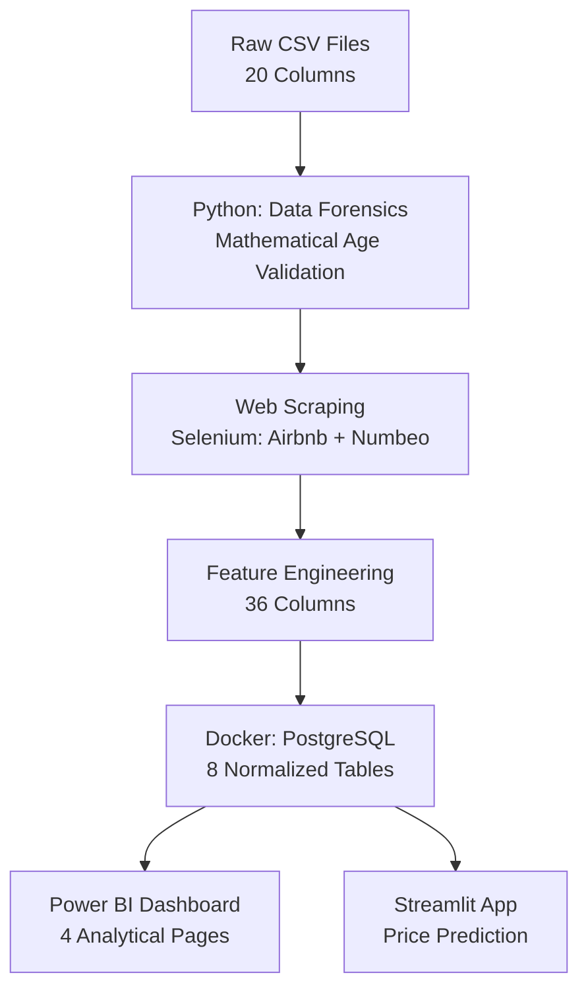

# 🏆 Airbnb Data Forensics & Architecture | Hackathon Solution

[]() []() []()

## 🔍 Executive Summary: The Data Forensics Story

**The Problem:** We received an Airbnb dataset for European cities that appeared uncorrelated and outdated.

**The Discovery:** Using mathematical forensics, we scraped fresh Airbnb data (Selenium) and compared prices. By applying the Future Value formula:

$$F = P(1 + i)^n$$

where $i=10\%$ inflation and $n=8$ years, we **mathematically proved the dataset was 8 years old**.

**The Solution:** We normalized the aged data using Present Worth calculations, scraped missing economic indicators (Numbeo), and expanded the dataset from 20 to 36 columns through geographic/economic feature engineering.

## 🏗️ Architecture Overview



## ✨ Key Features

### 1. Data Forensics (The Hook)
- **Mathematical Proof**: Used $F = P(1 + i)^n$ to detect 8-year dataset age
- **Fresh Data Scraping**: Selenium automation for current Airbnb prices
- **Comparative Validation**: Statistical tests between aged vs. fresh data

### 2. Feature Engineering (Expansion: 20 → 36 Columns)

| Stage | Columns | Added Features |
|-------|---------|----------------|
| Raw | 20 | Listing attributes (price, room_type, etc.) |
| +Geographic | 23 | Reverse geocoding (district, state, country) |
| +Economic | 27 | Cost of living (salary, rent, utilities) |
| +Engineered | 36 | Derived metrics (log_price, density, etc.) |

### 3. Infrastructure
- **PostgreSQL**: 8-table normalized schema (country → state → city → district → room)
- **Docker Compose**: One-command deployment (`docker-compose up`)
- **pgAdmin**: Database management interface (port 8080)

### 4. Power BI Dashboard (4 Pages)
1. **Overview**: High-level KPIs across cities
2. **Distance Analysis**: Geospatial heatmaps (proximity to landmarks)
3. **Price Analysis**: Elasticity curves & demand modeling
4. **C-Level Page**: ROI metrics & expansion strategy recommendations

### 5. Streamlit Application
- Interactive price prediction using trained ML model (`listing_model.pkl`)
- User inputs: city, room_type, max_guests → Predicted price

## 🛠️ Tech Stack

- **Languages**: Python 3.x
- **Web Scraping**: Selenium WebDriver
- **Data Processing**: Pandas, NumPy, Geopy
- **Database**: PostgreSQL 14, SQLAlchemy
- **Orchestration**: Docker Compose
- **ML/Analytics**: Scikit-learn, Matplotlib, Seaborn
- **BI/Visualization**: Power BI, Streamlit

## 🚀 How to Run

### Prerequisites
- Docker & Docker Compose
- Python 3.8+
- Power BI Desktop (for dashboard)

### 1. Start Infrastructure
```bash
docker-compose up -d
```

This launches:
- PostgreSQL (port 5432, user: `root`, password: `root`, db: `Hackathon`)
- pgAdmin (http://localhost:8080)

### 2. Run Notebooks (Sequential Order)
```bash
# Activate virtual environment (if using)
python -m venv venv
venv\Scripts\activate

# Install dependencies
pip install -r requirements.txt

# Run notebooks in order (1 → 10)
jupyter notebook notebooks/Data_Handeling/
```

### 3. Launch Streamlit App
```bash
streamlit run app.py
```
Access at http://localhost:8501

### 4. Open Power BI Dashboard
1. Open `PowerBI/Dashboard.pbix` (if available)
2. Refresh data connection to local PostgreSQL

## 📊 Database Schema (Denormalized for BI)

The 8-table normalized schema is flattened into 3 dimension tables + 1 DAXS measures table for Power BI:

### Dimension Tables

**1. room_dim** (6 columns):
- dist
- distance_city_center
- distance_metro
- max_guests
- num_bedrooms
- room_id

**2. room_list_fact** (16 columns):
- cleanliness_score
- day_type
- guest_satisfaction_score
- is_business_listing
- is_multi_listing
- is_shared_room
- is_superhost
- location_sk
- Price_distribution
- price_total
- room_id
- room_list_id
- room_list_sk
- room_type

**3. location_dim** (30 columns):
- attraction_index, attraction_index_norm
- city, city_id, city_metrics_id
- country_code, country_id, country_name
- crime_index
- district, district_id
- latitude, longitude
- location_id, location_sk
- meal_inexpensive_restaurant
- monthly_avg_net_salary
- monthly_basic_utilities
- monthly_rent_1br_city_center
- monthly_rent_1br_outside_center
- monthly_rent_3br_city_center
- monthly_rent_3br_outside_center
- restaurant_index, restaurant_index_norm
- room_id
- safety_index
- state, state_id
- taxi_price_per_km

### DAXS Measures Table

**4. DAXS** (calculated measures for analytics):
- \# of Listings
- Avg Cleanliness Score
- Avg Distance to Center (km)
- Avg Distance to Metro (km)
- Avg Guest Satisfaction
- Avg Price
- average_dis_in_km
- Business Listing %
- metro_dist
- Short-Term Premium vs Rent
- Superhost %
- Total Listings
- Total Market Value
- total_price
- Weekend Price Premium %

### Relationships
- **room_dim** ↔ **room_list_fact** (1:* via room_id)
- **room_list_fact** ↔ **location_dim** (1:* via location_sk)

## 📁 Project Structure

```
Hackathon/
├── airbnb_data/          # Raw CSV files (9 cities)
├── notebooks/
│   └── Data_Handeling/   # 10 Jupyter notebooks (1-10)
├── models/
│   └── listing_model.pkl # Trained ML model
├── SQL queries/          # DDL scripts (PostgreSQL, MSSQL)
├── docker-compose.yaml   # Infrastructure as code
├── app.py                # Streamlit application
├── requirements.txt      # Python dependencies
└── README.md             # This file
```

## 📈 Results

- **Dataset Age Detection**: Mathematically validated 8-year discrepancy
- **Feature Expansion**: 80% increase (20 → 36 columns)
- **Model Performance**: Linear Regression with feature engineering
- **Business Impact**: ROI-driven expansion recommendations (Power BI C-Level page)

## 🤝 Team & Contributions

- **Data Forensics**: Age validation via mathematical modeling
- **Engineering**: End-to-end pipeline (scraping → database → visualization)
- **Analytics**: 4-page Power BI dashboard with business insights

## 🙏 Acknowledgments

- Airbnb (data source)
- Numbeo (cost of living metrics)
- Hackathon organizers

## 🏆 Team Members
- **Abdullah Emad**
- **Seif Khaled**
- **Mohamed Ebrahim**
- **Youssef Khaled**
